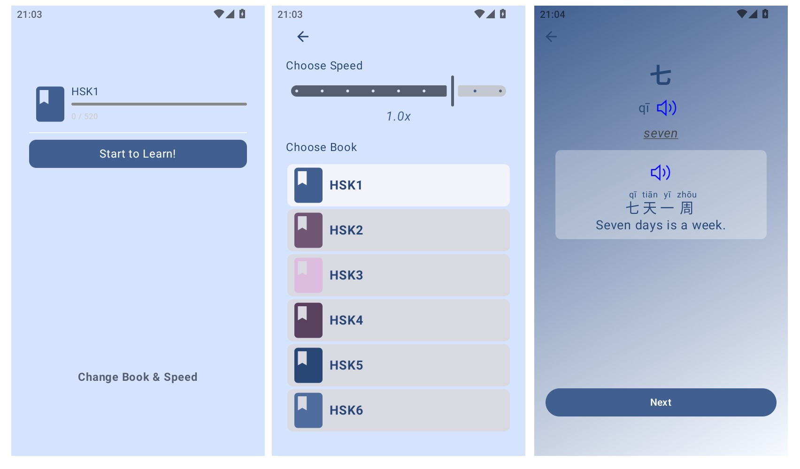

# Yuyuan - Learn Chinese 
Yuyuan(语缘) is an Android app for Chinese learning, especially words   
This app can run on API 24 or higher without network, all data is bundled in the apk file  
**Note**: Under construction...

# Features  
- [x] HSK1-6 all words included  
- [ ] Daily learning plan  
- [ ] Word Training   
- [ ] Character writing exercises  
- [ ] Lessons designed for different topics  
- [ ] Learning calendar  
- [ ] Article reading exercises  

# New Updates
- 2025-04-21: Implemented basic function(play word & sentence sound, choose speed, choose book)
- 2024-12-13: Updated the structure to a modern way, with data and ui layers 

